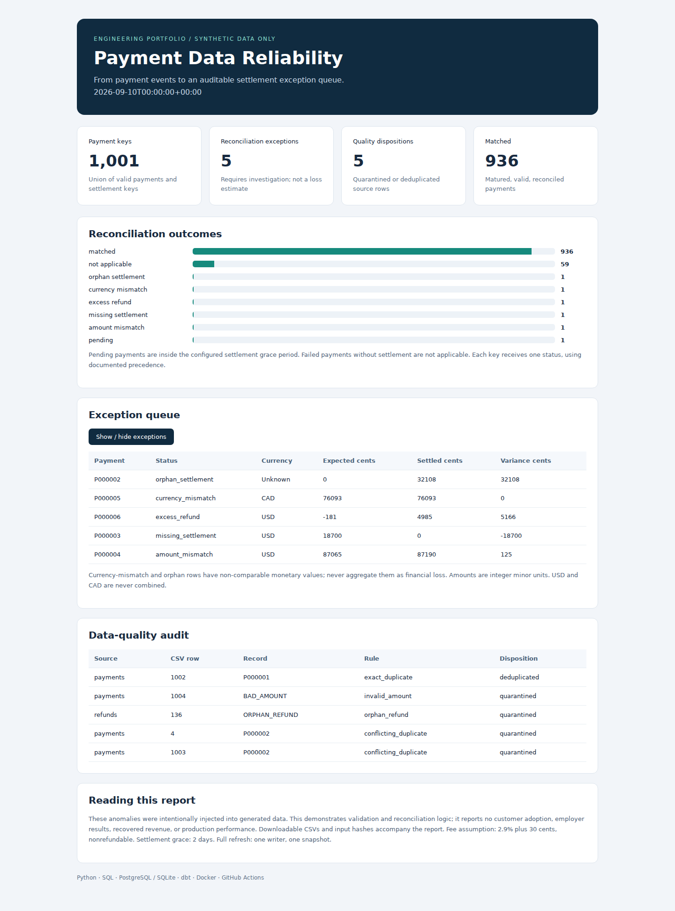
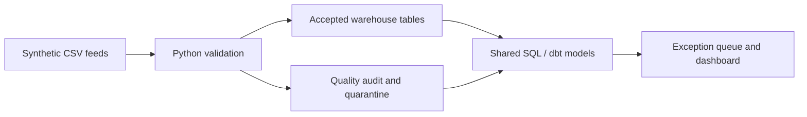

# Payment Data Reliability Pipeline

**An auditable payment-to-settlement pipeline with explicit data-quality decisions.**

Python · SQL · PostgreSQL · dbt · Docker · GitHub Actions

This engineering portfolio project turns three synthetic CSV feeds into validated warehouse tables, an exception queue, per-currency metrics, and an offline dashboard. It demonstrates how to catch anomalies without double-counting money or silently selecting a winner among conflicting records.

**All data and anomalies are generated.** This is an AI-assisted portfolio implementation, not an employer system or evidence of production adoption. Qasim should review, run, and understand it before presenting it as his portfolio. No company code, customer records, credentials, personal information, or payment-card data is included.



A ready-to-open dashboard is included at `docs/demo/dashboard.html` (open the downloaded file in your browser; GitHub does not render HTML files directly).

## Quick start: no database server needed

Requires Python 3.11 or 3.12. Extract/clone this repository and open a terminal in its root.

```bash
python -m venv .venv
```

Activate on Windows PowerShell:

```powershell
.venv\Scripts\Activate.ps1
```

Activate on macOS/Linux:

```bash
source .venv/bin/activate
```

Run:

```bash
python -m pip install -e .
python -m payment_reliability.cli generate
python -m payment_reliability.cli run
python -m unittest discover -s tests -v
```

Open **`output/dashboard.html`** in a browser. It is self-contained: no account, network connection, JavaScript library, or web server needed. A pre-generated copy is also in `docs/demo/dashboard.html`.

The default execution uses SQLite and the **same SQL model files** as dbt. There are no third-party runtime dependencies for this route. This is a source-checkout application: use the editable install above; dbt models live beside `src/`.

## What it catches

| Control | Decision |
|---|---|
| Exact replay of a source ID | Keep one; record discarded copies |
| Conflicting records for one source ID | Quarantine every version; do not guess |
| Missing fields, invalid amounts/status/currency/time | Quarantine with CSV row and original payload |
| Orphan, wrong-currency, premature, or failed-payment refunds | Quarantine; block affected valid payment from matching |
| Rejected payment-linked records | `data_quality_blocked` for an otherwise valid payment |
| Settlement with no accepted payment | `orphan_settlement` |
| Settlement currency differs from payment | `currency_mismatch`; exclude from monetary aggregates |
| Settlement predates payment | `settlement_before_payment` |
| Failed payment receives a settlement | `unexpected_settlement` |
| Completed refunds exceed original amount | `excess_refund` |
| Payment is inside settlement grace period | `pending`, even if an interim settlement exists |
| Matured payment lacks settlement | `missing_settlement` |
| Matured net amount differs | `amount_mismatch` |
| Valid matured payment balances exactly | `matched` |

See [the data contract and rule precedence](docs/DATA_CONTRACT.md) for boundaries and assumptions. These are demonstrative business rules, not a processor's contractual terms.

## Architecture



The Python loader records all raw rows, validates source contracts, and replaces the accepted snapshot within a transaction. Monetary calculations use integer minor units. Refund and settlement streams are aggregated **before** joins to avoid fan-out. SQL preserves orphan settlement keys. Input SHA-256 hashes, a fixed evaluation date, and a seed make runs reproducible.

## PostgreSQL + dbt + Docker

Install Docker with Compose v2. Copy `.env.example` to `.env`, then replace its demo password. This password is only for your local demo; `.env` is excluded from Git.

```bash
docker compose up --build
```

Open **http://localhost:8080/dashboard.html** after the pipeline and dbt tests finish. PostgreSQL is not exposed on a host port. The dashboard binds only to localhost. The pipeline container runs as a non-root user. Named volumes preserve demo database and reports.

To re-run generation, loading, and dbt after an edit:

```bash
docker compose run --rm pipeline
```

To stop while keeping demo data:

```bash
docker compose down
```

The local dashboard uses Python's development HTTP server. This is not an authenticated public deployment.

### Existing local PostgreSQL instead of Docker

Use a dedicated demo database and set `PGHOST`, `PGPORT`, `PGDATABASE`, `PGUSER`, and `PGPASSWORD` in your shell. Never commit real credentials.

```bash
python -m pip install -e '.[warehouse]'
python -m payment_reliability.cli generate
python -m payment_reliability.cli run --backend postgres
dbt build --project-dir dbt --profiles-dir dbt
```

The loader owns the `reliability` schema. dbt creates the `analytics` schema and builds the same SQL as warehouse views. A singular dbt test compares its reconciliation result against the loader's view in both directions. Standard dbt tests validate uniqueness, required values, refund relationships, and status vocabulary.

## Example output

Default seed: `42`; base payments: `1,000`; fixed evaluation date: September 10, 2026 UTC. Deliberate controls include one exact replay, two conflicting rows, a missing settlement, a 125-cent mismatch, a wrong-currency settlement, an excess refund, an orphan refund, an invalid amount, and a recent pending payment.

| Artifact | Purpose |
|---|---|
| `output/dashboard.html` | Offline visual review |
| `output/payment_reconciliation.csv` | One row per accepted payment/settlement key |
| `output/quality_issues.csv` | Row-level decisions with original payloads |
| `output/daily_metrics.csv` | Status totals by date and currency |
| `output/summary.json` | Counts, parameters, and input hashes |
| `output/warehouse.sqlite` | Queryable local warehouse (SQLite route) |
| `data/manifest.json` | Seed, synthetic-data declaration, control cases |

```bash
python -m payment_reliability.cli generate --count 10000 --seed 123
python -m payment_reliability.cli run --as-of 2026-09-10T00:00:00+00:00 --grace-days 2
```

The demo intentionally contains failures. Normal execution exits successfully once the report is produced. To make anomalies block an operational job:

```bash
python -m payment_reliability.cli run --strict
```

Strict mode exits **2** for reconciliation exceptions or quarantined source records. Exact replays alone do not fail the gate. Invalid input contracts exit **1**. Unit tests test the engine, so intentional data anomalies do not imply test failures.

## Testing and CI

Tests cover deduplication, conflict quarantine, replay idempotence, refund arithmetic, full refunds with negative net settlement, split settlements, timezone validation, grace-period boundaries, currency separation, and HTML escaping. PostgreSQL parity runs when `TEST_POSTGRES=1` and a database is available. CI runs Python 3.11/3.12, then PostgreSQL 16 and dbt with a service container. A separate Docker smoke job builds the image, runs the container pipeline and dbt tests, and checks that the dashboard is served.

See [verification results](docs/VERIFICATION.md) for what was actually executed in the preparation environment. A workflow definition is not a claim that a GitHub Actions run has passed.

## Scope and engineering trade-offs

- **Snapshot processing**, not streaming or incremental CDC. Re-running identical inputs is idempotent; changed inputs replace the snapshot. No durable history across runs.
- **Single writer** and small-to-medium demonstration feeds; CSVs are held in memory. Do not run concurrent loaders. The database transaction is atomic; report files are written after commit and are not part of that transaction.
- **USD/CAD only**, no FX conversion. Counts may be combined; money is grouped by currency. Diagnostic variances are not recovered funds or proven losses.
- **Cumulative net settlement per payment** as of the snapshot; fee is nonrefundable. No chargebacks, reserves, processor-specific rounding, banking holidays, or refund-specific settlement grace.
- Source timestamps are business-event times, not ingestion-watermark evidence. Production freshness monitoring and incremental ingestion remain future work.
- No production authentication, encryption/key management, tenancy, alert routing, recovery SLA, or compliance certification is claimed.

## Publishing and presenting

Follow [START_HERE.md](START_HERE.md) to publish the repository. Do not upload `.env`, virtual environments, real data, or company code. Describe the project as a synthetic portfolio demonstration. Do not claim production adoption, employer sponsorship, or measured customer impact from its generated metrics.

For a review conversation, be ready to explain the fee model, why money avoids floats, why conflicts are quarantined, how join fan-out is avoided, when a payment becomes overdue, and what is required for production deployment.

## Technical references

- [dbt Postgres setup](https://docs.getdbt.com/docs/local/connect-data-platform/postgres-setup)
- [Docker Compose startup order](https://docs.docker.com/compose/how-tos/startup-order/)
- [Python sqlite3 transactions](https://docs.python.org/3/library/sqlite3.html)

## License

MIT; see [LICENSE](LICENSE). Review and adapt the project before public release.
